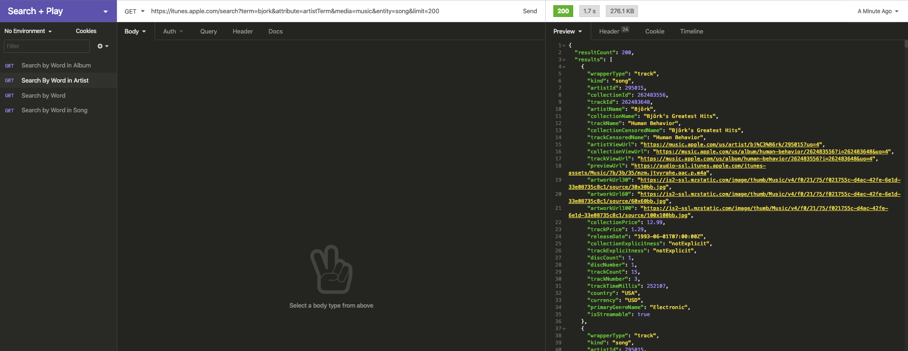
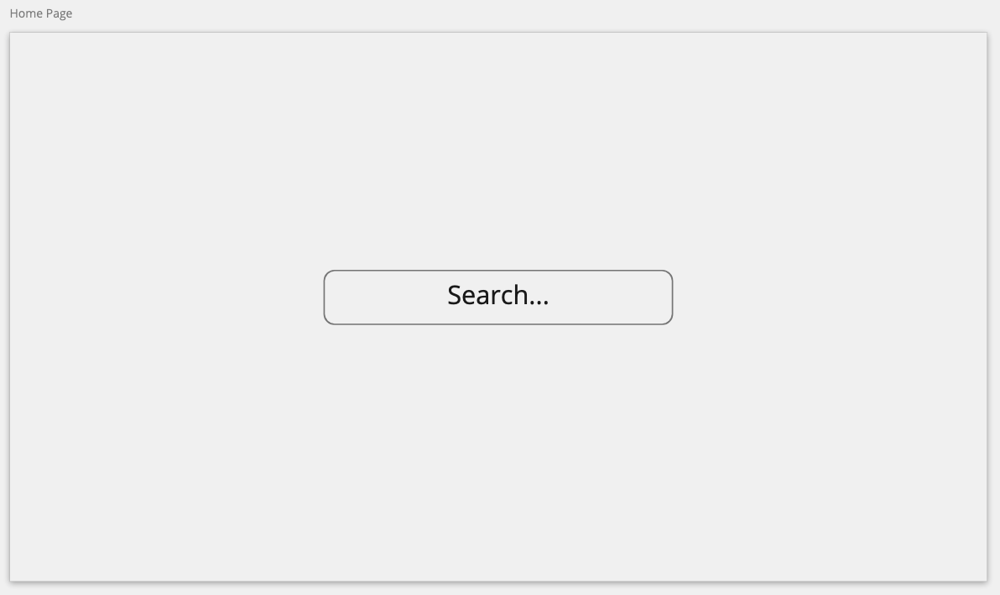
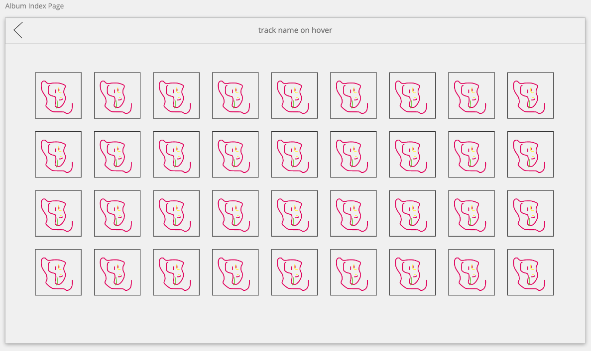
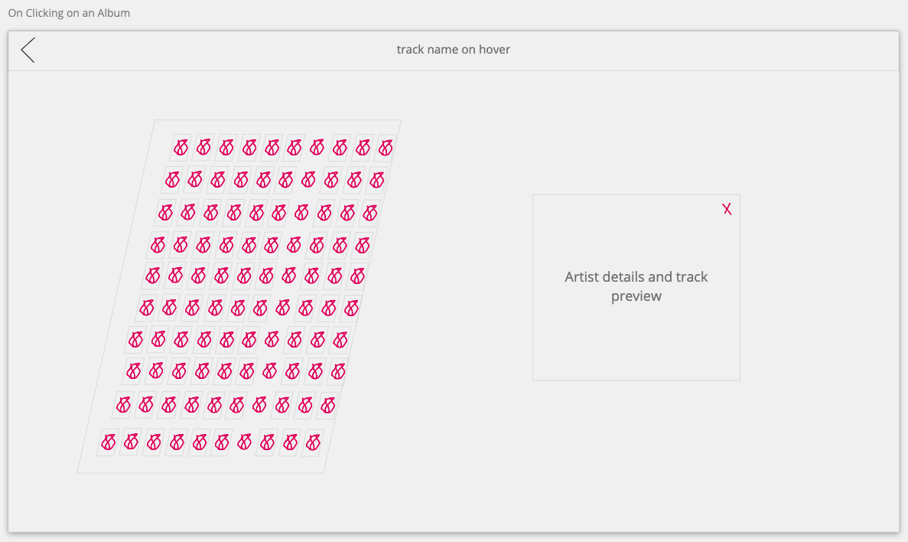
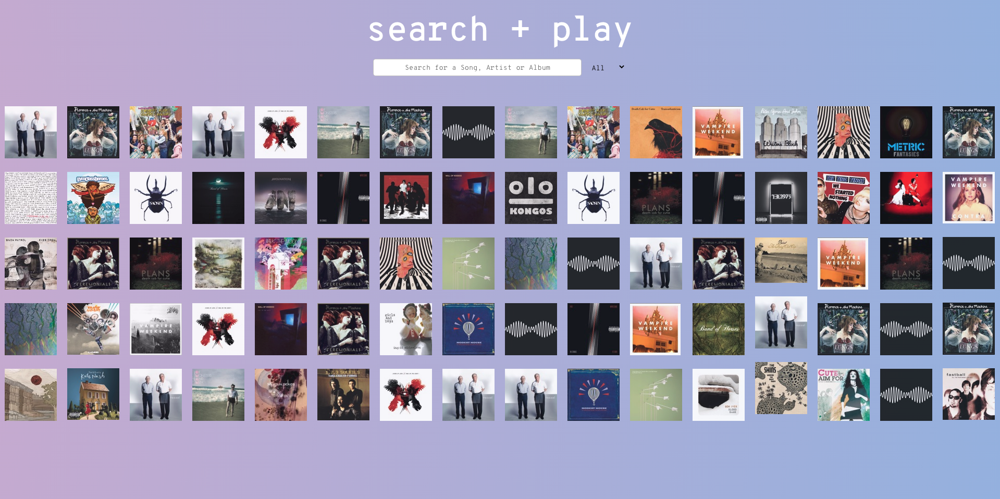

# General Assembly Project 2: Search + Play

**_Timeframe_**

36 hours

## 1.0 - Brief:

Pair Programming hackathon project strictly focusing on client side technologies and AJAX requests.

## 2.0 - Technologies Used

- iTunes Search API
- React.js
- JavaScript (ES6)
- HTML 5
- SASS/SCSS/CSS Animation
- Bulma
- Git/GitHub
- Axios
- React-Audio-Player

# Search + Play

An interactive & animated music preview app based on the [iTunes Search API](https://developer.apple.com/library/archive/documentation/AudioVideo/Conceptual/iTuneSearchAPI/Searching.html#//apple_ref/doc/uid/TP40017632-CH5-SW1)

### Deployed version

https://search-and-play.netlify.app/

## 4.0 - Code Installation

https://github.com/purvitrivedi/search-and-play

- Clone or download the repo
- Install yarn in Terminal by typing: <code>yarn</code>
- Start server with yarn start

## 5.0 - Planning

### 5.1 - Allocating Responsibilities

Once the initial concept was confirmed and we wanted to proceed into planning the app - We wanted to set out clear goals, milestones and responsibilities for the remainder of the project.

We both wanted to get exposure to all aspects of the project and so we confirmed that we would have joint responsibility for testing APIs and setting up all AJAX requests then we would split up different areas of the UI into our own responsibilities. 

### 5.2 - Selecting an API

We tested various music APIs which provided us with songs based on the params fed into the HTTP requests and the aim for us was to start refining which API we would use for the app.

We used Insomnia to test the various APIs and we were judging which one to use on the following criteria:
- Ease of documentation
- How strict the API wwas in terms of what params were sent
- The selection of songs available
- The detail of the API response for a song

After assessing the APIs, we settled on using iTunes Search API mainly because of how forgiving the API was for what params were sent to it. Ultimately it would be users who are searching for songs on the app and so poor grammer and spelling mistakes would not have crashed the app because iTunes were very good at figuring out what was typed and still sent a response.

 Many other apps we tried would reject the http request if it was spelt wrong and this would have led to the app failing.

 The documentation from iTunes was also very well put together and clear of the requirements.

### 5.3 - API Example Requests

- Search by Word: https://itunes.apple.com/search?term=solange&media=music&entity=song&limit=200

- Search by Word in Song: https://itunes.apple.com/search?term=garden&attribute=songTerm&media=music&entity=song&limit=200

- Search by Word in Artist Name: https://itunes.apple.com/search?term=cutchemist&attribute=artistTerm&media=music&entity=song&limit=200

- Search by Word in Album Name: https://itunes.apple.com/search?term=butterfly&attribute=albumTerm&media=music&entity=song&limit=200

### 5.4 - Prototypes with Miro

Miro was used to prototype the app as it was a simple to setup and use platform which allowed us to create designs with minimal effort (due to the limited time of the hackathon, this was essential).

We experiemented with different layouts and decided quite early on that we would focus less on the amount of content we put into the app but work more on creating an interesting user experience with different css effects and transitions.

This would effectively mean we were leaving the content of the app to be determined by the user search and the API response. 

As a result, we decided on a simple two page application - The search/home page and the music index page (single page react app but two views to be rendered) .

  

## 6.0 - Development

### 6.1 - The Home Page

Initially we both worked on the home page as we wanted to get the Axios requests set up first and so we used VSCode livesharing so we could both type the code on the same file at the same time (as we were both working remotely).

The home page consistented of two main elements: Search bar and a selection of random album covers. Upon mount, the album covers were consumed from the iTunes API with a get request and then mapped out in the component.

    export const getAllSongs = (term, attribute) => {
      if (attribute === 'Any') {
        return axios.get(`https://cors-anywhere.herokuapp.com/https://    itunes.apple.com/search?term=${term}&media=music&entity=song&   limit=200`)
      }
      else {
        return axios.get(`https://cors-anywhere.herokuapp.com/https://    itunes.apple.com/search?term=${term}&attribute=${attribute}&    media=music&entity=song&limit=200`)
      }
    }

<em><code>cors-anywhere.herokuapp</code> was added after the deployed on Heroku so we are not blocked by CORS policy.</em>

The search bar was a controlled component within the Home page's state and the user's input was stored in state so once the form had been submitted, the user would be taken to the music index page and the query would be stored within the url so the index page could make the axios request.
The dropdown selection would allow a user to refine their search (dropdown options were limited to what attriubtes the API would accept) or if no attribute was selected, the ternary operator would set it to 'Any' and add that to the url query.

    handleSubmit = (event) => {
      let term = this.state.search.term
      if (!term) {
        this.setState({ validate: false })
        return
      }
      let attribute = (this.state.search.attribute ? this.state.search.attribute : 'Any')
      this.props.history.push(`/tracks/${term}&${attribute}`)
    }

### 6.2 - Music Index Page

Upon mounting, the home page had set the url to contain the queries required and so the ComponentDidMount function would gather this information and send the GET request over to iTunes. The code below was used to format the search term and attribute into a format which would be accepted by the API in the GET reqeust. It would take the url string and remove the '/' and replace space characters with a '+'.

    const urlDetails = this.props.location.pathname
        const term = urlDetails.split('/')[2].split('&')[0].replace(' ', '+')
        const attribute = urlDetails.split('/')[2].split('&')[1]

The http response was an array of songs which was then mapped to the index page to show the song's album image.

There are two events on the displayed album covers:

onMouseEnter: show the track and artist name in the NavBar
onMouseClick: Skew the index and show the artist details and play the song.

    handleClick = (event) => {
      this.setState({ isSkewedIndex: true })
      setTimeout(() => { this.setState({ singleArtist: event, isShowingArtist:  true, volume: 0.6 }) }, 500)
    }

I was responsible for adding the transition effect when the user clicked on an album which would alter the state and cause the song to transition in while the album index skewed.
The ternary operators would check if an album was clicked and then add the css class 'slidingAnimation' which would cause the CSS effect to fire.

    

        <MusicShow
        {...this.state.singleArtist}
        onClick={this.handleBackClick}
        volume={this.state.volume}/>
    

### 6.3 - Artist Show Section:

The code snippet below details the CSS used to cause the skew effects and the sliding transition for the index and show pages.

    .skew {
      transform: rotateY(55deg) skew(-13deg) scale(0.95);
      box-shadow: 4px 10px 36px -2px rgb(241, 240, 169);

      @media (max-width: 800px) {
        display: none;
      }
    }

and the Artist show section comes in with Sliding Animation:

    .slidingAnimation {
      animation: slide 1s ease;
      animation-fill-mode: forwards;
      background-image: linear-gradient(
        to right,
        rgba(247, 247, 247, 0),
        rgb(10, 10, 9)
      );
      right: -400px;
    }

    @keyframes slide {
      100% {
        right: 0px;
      }
    }

We tried a few different audio players to see which felt better and we also wanted one that allowed the user to have controls, autoplayed when component mounted and visually was fair interesting. 

We found that audio players were actually fairly tricky to style and ideally if we had more time we would have put more time into this element however we had to prioritise other features in the short timespan.

In this page we use the React Audio Player as it's slightly better than HTML Audio player. We set it to 'autoplay' so the song begins playing as the page animates into this section:

    <ReactAudioPlayer autoPlay controls={true} src={props.previewUrl} volume={props.volume}/>

### 6.4 - Finishing Touches & Styling

Once the core features were implemented and working smoothly, we used the remaining time just to experiement with interesting effects and pre-built React components.

Initiially we planned to give ourselves a minimum of 5 hours to just focus on the user experience and so we knew from this point that anything extra we could add in was just a bonus. Wanting to make it as best we could, we still kep the intensity up until the deadline.

### 7.0 - Self Reflection
## 7.1 - Wins

- Despite being a little bit confusing, I really enjoyed making the albums flash randomly throughout the page by adding transitions and classes to be added based on a random number generator.
- It was great practice to work with my peer and we worked very well together, bouncing ideas off one another. It was also the first time using VSCode liveshare so it was interesting to get used to typing on the same file as somebody else.

## 7.2  -Challenges

- Due to the short timescale, it sometimes was tricky to keep code as clean as possible however this is a minor issues which a bit of time refactoring would resolve.
- We experienced CORS issues when trying to make AJAX request once deployed to Heroku however this was resolved with altering the http paths which can be found in the lib folder.

